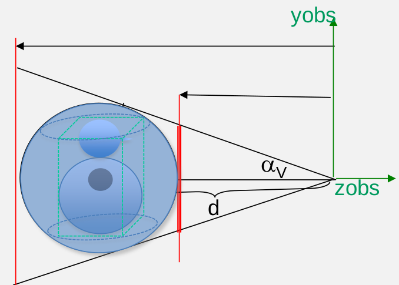

# CheatSheet IDI ExamenLab (OpenGL i GLSM)

##Transformacions Geomètriques (*TG*)

```c
glm::mat4() = glm::scale(glm::mat4(), glm::vec3());
```
```c
glm::mat4() = glm::translate(glm::mat4(), glm::vec3());
```
```c
glm::mat4() = glm::rotate(glm::mat4(), (float), glm::vec3());
```

###*Aplicació*

A la funció Transform:

```c
TG = I;
```
```c
TG = glm::translate(TG, posObjecte);
```
```c
TG = glm::scale(TG, glm::vec3(escala_x, escala_y, escala_z);
```
```c
TG = glm::rotate(TG, angle_x, glm::vec3(1,0,0));
```
```c
TG = glm::rotate(TG, angle_x, glm::vec3(0,1,0));
```
```c
TG = glm::rotate(TG, angle_x, glm::vec3(0,0,1));
```
```c
TG = glm::translate(TG, centreObjecte);
```


##Project i View Transform

### Project Transform

```c
glm::mat4() = glm::perspective((float) , (float), (float), (float));
```
```c
glm::mat4() = glm::ortho((float), (float), (float), (float), (float), (float));
```

\pagebreak

#### *Aplicació*

```c
float radiEsc = distance(CapsaEscenaMin, CapsaEscenaMax)/2.f;
```
```c
float angle_inicial = glm::asin(radiEsc/(2*radiEsc));
```

{width=200px}

```c
float FOV = angle_inicial*2;
```
```c
float ra = amplada/altura;
```
\vspace{0.4cm}

```c
Proj = glm::perspective(FOV , ra, radiEsc, 3.0f*radiEsc);
```
```c
Proj = glm::ortho(-radiEsc, radiEsc, -radiEsc, radiEsc, radiEsc, 3.0f*radiEsc);
```
##View Transform (Euler)

```c
float d = glm::distance(OBS, VRP);
```
```c
View = glm::translate(glm::vec3(1.f), glm::vec3(0.f, 0.f, -1*d));
```
```c
View = glm::rotate(View, Phi, glm::vec3(0,0,1)); 
``` \hfill  //Phi  = $\phi$

```c
View = glm::rotate(View, Theta, glm::vec3(1,0,0)); 
``` \hfill  //Theta  = $\theta$

```c
View = glm::rotate(View, Psi, glm::vec3(0,1,0)); 
``` \hfill  //Psi  = $\psi$

```c
View = glm::translate(View, glm::vec3(-1*VRP.x, -1*VRP.y, -1*VRP.z)); 
```
\pagebreak

##Resize

```c
ra = ample / (float)alt;
```
```c
if(ra < 1)
{
	FOV = 2.f*glm::atan(glm::tan(angle_inicial )/ra);
}else
{
	FOV = 2*angle_inicial;
}
```

#Shaders

##Càlcul de color al Vertex Shader	
```c
mat3 matNormalInvers = inverse (transpose (mat3 (view * TG)));
```
```c
vec3 coordSCO = (matNormal * vec4 ( vertex, 1.0)).xyz ;
```
```c
vec3 posF = (/*view * */ vec4(posFocus , 1.0)).xyz;
```
```c
vec3 L = posF- coordSCO;
```
```c
vec3 normalNormal = matNormalInvers * normal;
```
```c
L = normalize(L);
```
```c
normalNormal = normalize(normalNormal );
```
```c
vec3 a;
```
```c
fcolor = Phong(normalNormal, L, vec4(coordSCO, 1.0));
```
```c
gl_Position = proj * view * TG * vec4 (vertex, 1.0);
```

##Càlcul de color al Fragment Shader

```c
mat4 matNormal = view * TG;
```
```c
vec3 coordSCO = (matNormal * vec4 (vert, 1.0)).xyz ;
```
```c
vec3 L = posF - coordSCO;
```
```c
vec3 normalNormal = matNormalInvers * norm;
```
```c
L = normalize(L);
```
```c
normalNormal = normalize(normalNormal );
```
```c
vec3 a;
```
```c
a = Phong(normalNormal, L, vec4(coordSCO, 1.0));
```
```c
FragColor = vec4(a,1);	
```

